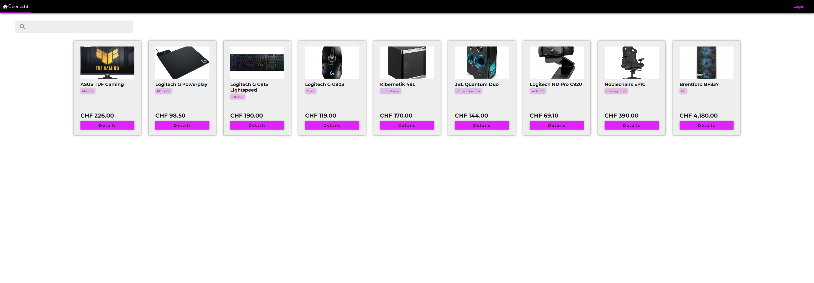
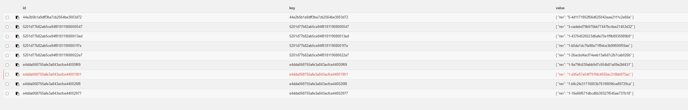

# BZT-M165

## Start Project

```shell
docker compose up -d
``` 

* Fauxton: http://localhost:16599/_utils
  * Username: admin
  * Password: admin
* Webview: http://localhost:16500
* Backend API: http://localhost:16501

## How to insert data

1. Open the [webview](http://localhost:16500) in your browser.
2. Click the login button.
3. Navigate to "Neues Produkt" using the new items in the navigation bar.
4. Insert a name, a category, a price and a url to an image.
5. If you want to add more information click on "Attribut hinzufügen".
   1. Add a unique name for your attribute.
   2. Insert the value.
6. Click on "Speichern".

## Screenshots

* Testdaten im Frontend: 
* Testdaten im Fauxton: 
